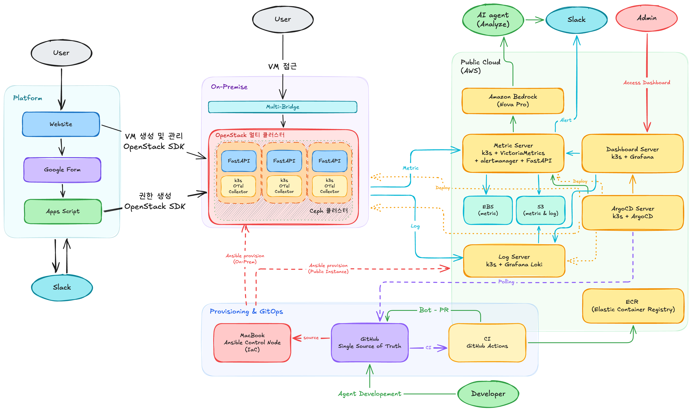

# On-Prem Multi-Node Observability System & Analyzer AI Agent

## 팀

- 기간: 2026.04.13 ~ 2026.06.29
- 팀 구성: 5인
- 담당: 팀장, Observability, Analyzer AI Agent
OpenStack 기반 클라우드 제공 플랫폼(온프레미스 멀티 노드)을 원격으로 관측하고, 이상 신호 발생 시 Slack 알람과 함께 AI Agent가 원인 분석 및 해결 가이드라인을 자동으로 제공하는 옵저버빌리티 시스템입니다.

## 개요

현대오토에버 모빌리티 SW스쿨(클라우드) 부트캠프 최종 프로젝트로, 2026년 4월 13일 ~ 6월 29일 동안 5인 팀으로 진행했습니다. 이 저장소는 그중 Observability 전 영역과 Analyzer AI Agent를 다룹니다.

## 🏗️ 아키텍처



## 프로젝트 배경

팀 프로젝트 주제는 **"OpenStack 기반 클라우드 제공 플랫폼"** 입니다. 

저는 플랫폼의 근간이 되는 온프레미스 노드(3대)에 대한 **Observability 구축** 과 장애 감지 후 장애 분석 및 해결 가이드라인을 제공해주는 **분석용 AI Agent 개발** 을 담당했습니다.

노드 장애 시에도 온프레미스 노드를 관측하고자 **원격 관측** 방식을 채택하였습니다. 또한 옵저버빌리티 시스템 구축 및 운영 전과정을 코드로 관리할 수 있도록 **Iac(Ansible) & GitOps(GitHub Actions, ArgoCD)** 방식을 채택했습니다.

## 목적

- **원격 관측**: 온프레미스 노드와 관측 인프라를 분리해, 노드 장애가 관측 시스템 자체를 무너뜨리지 않도록 한다.
- **자동 알람**: 임계치를 넘는 이상 신호를 즉시 관리자 Slack으로 전달한다.
- **원인 분석 자동화**: 알람 이후 사람이 직접 로그/메트릭을 탐색하는 대신, 분석용 AI Agent가 컨텍스트를 수집하고 원인과 해결 가이드라인을 제시한다.
- **IaC / GitOps**: 서버 프로비저닝과 배포를 코드로 관리해 반복 작업과 수동 개입을 최소화한다.

## 시스템 구성

| 영역 | 구성 요소 | 역할 |
|---|---|---|
| Platform | Website, Google Form, Apps Script | 사용자 VM 생성/관리 요청, 권한 생성 (OpenStack SDK) |
| ✅ (담당) On-Premise | Multi-Bridge, OpenStack 멀티 클러스터(FastAPI + k3s OTel Collector), Ceph 클러스터 | 관측 대상 노드. DaemonSet으로 배포된 OTel Collector가 Metric/Log 수집 |
| ✅ (담당) Public Cloud (AWS) | Metric Server(k3s + VictoriaMetrics + vmalert + FastAPI), Log Server(k3s + Grafana Loki), Dashboard Server(k3s + Grafana), ArgoCD Server, Amazon Bedrock(Nova Pro) | 시그널 저장/쿼리, 대시보드, 이상 신호 감지, AI 분석 |
| ✅ (담당) Storage | EBS, S3, ECR | Metric(hot: EBS / cold: S3), Log(S3), 컨테이너 이미지(ECR) |
| ✅ (담당) Provisioning & GitOps | MacBook(Ansible Control Node), GitHub(SSOT), GitHub Actions(CI) | IaC 프로비저닝, CI/CD, 봇 PR 자동화 |
| ✅ (담당) Admin | Slack, Dashboard 접근 | 알람 수신, AI 분석 결과 확인, 대시보드 조회 |

수집(OTel Collector) → 저장 및 쿼리(VictoriaMetrics / Loki) → 관측(Grafana) → 알람(Alertmanager → Slack) → 분석(AI Agent → Slack 스레드) 순으로 동작합니다.

## 기술 스택

| 구분 | 기술 | 선정 이유 |
|---|---|---|
| Collector | OpenTelemetry Collector | 단일 Agent로 Metric/Log/Trace 모두 수집, OTLP(Push) 지원 |
| Metric Server | VictoriaMetrics + vmalert | 원격 관측 지향 설계, OTel과 높은 호환성, 압축률/리소스 효율 우수 |
| Log Server | Grafana Loki | 프로젝트 규모 대비 저비용/경량, 필요 기능이 무료 범위 내 |
| Dashboard | Grafana | Metric/Log 통합 시각화 |
| Alert | Alertmanager (vmalert / Loki Ruler) | 임계치 감지 후 Slack 알람 발송 |
| IaC | Ansible | Agentless, 멱등성, SSH 기반 다수 서버 일괄 프로비저닝 |
| GitOps | ArgoCD (App of Apps 패턴) | 중앙 관리형 배포, GitHub를 SSOT로 사용 |
| Container Registry | AWS ECR | Agent 이미지 관리, CI에서 push |
| AI 모델 | Amazon Bedrock (Nova Pro) | 알람 컨텍스트 기반 원인 분석/해결 가이드 생성 |
| Storage | EBS(hot) / S3(cold) / Glacier(archive) | 인스턴스와 분리된 내구성 있는 시그널 저장 |
| Kubernetes | k3s | 경량 쿠버네티스, 각 역할별 서버에 설치 |
| CI/CD | GitHub Actions(CI) / ArgoCD(CD) | 이미지 빌드/푸시, 봇 PR 자동 생성 |

## 리포지토리 구조

```
.
├── apps/                      # ArgoCD Application 매니페스트 (App of Apps)
│   ├── ai/ai-analyzer/        # Analyzer AI Agent (FastAPI, Bedrock)
│   ├── metric-server/         # VictoriaMetrics, vmalert, EBS CSI
│   ├── log-server/            # Grafana Loki
│   ├── dashboard-server/      # Grafana + 대시보드 JSON
│   ├── openstack-nodes/       # 온프레미스 노드 OTel Collector 배포
│   └── openstack-finops/      # 비용/리소스 exporter
├── infrastructure/            # Ansible (IaC): inventory, playbook, group_vars
└── root-application.yaml      # ArgoCD App of Apps 루트
```

`root-application.yaml`이 `apps/**/application.yaml`을 재귀적으로 탐색해 자동 동기화합니다.

## 프로비저닝 (IaC)

Ansible로 On-Prem 노드와 Public Cloud 인스턴스에 k3s를 일괄 설치합니다.

```sh
ansible-playbook -i infrastructure/inventory.ini infrastructure/setup-k3s.yaml
```

- Control Node: 로컬(맥북)
- Inventory: 대상 서버 주소록 (`infrastructure/inventory.example.ini` 참고)
- Playbook: k3s 설치 및 kubeconfig 세팅 (`infrastructure/setup-k3s.yaml`)

## 참고 자료

프로젝트 구축 과정을 정리한 블로그 시리즈입니다.

1. [Tech Blog - 프로젝트 개요 및 기술 스택 선정](https://velog.io/@pizza_loves_me/Project-On-Prem-Multi-Node-Observability-System-Analyzer-AI-Agent)
2. [Tech Blog - Observability 구축 과정](https://velog.io/@pizza_loves_me/Project-On-Prem-Multi-Node-Observability-System-Analyzer-AI-Agent-2-Observability-구축-과정)
3. [Tech Blog - 분석용 AI Agent 구축](https://velog.io/@pizza_loves_me/Project-On-Prem-Multi-Node-Observability-System-Analyzer-AI-Agent-3-분석용-AI-Agent-구축)
